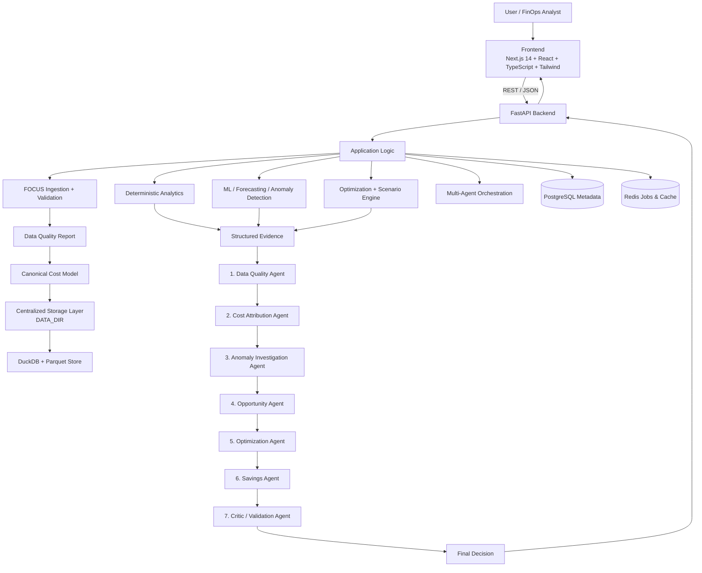

# CloudSpend Intelligence

> Production-Quality FinOps Decision-Intelligence Platform powered by FOCUS Billing Data, Statistical Analytics, Machine Learning, and Multi-Agent Evidence Reasoning.

---

## 1. Executive Summary

**CloudSpend Intelligence** is a portfolio-grade FinOps decision-support platform designed to answer critical cloud spend questions:
1. Where is technology spend going?
2. Why did spend change month-over-month?
3. Which accounts, services, or resources drove the change?
4. Which cost spikes are statistically anomalous?
5. What optimization actions are plausible, what could they save, and how confident is the system?

Core operational loop:
```text
OBSERVE → EXPLAIN → DETECT → DIAGNOSE → OPTIMIZE → ESTIMATE → VALIDATE → DECIDE
```

---

## 2. Key Architecture Principles

- **Deterministic Truth**: All financial calculations, period-over-period attribution, statistical z-scores, and time-series forecasts originate from DuckDB SQL and deterministic Python code. **The LLM never owns numerical truth.**
- **Google Gemini Integration**: Gemini is used exclusively for natural-language explanations and contextual reasoning over structured JSON evidence. (Configured via `GEMINI_MODEL=gemini-3.6-flash`).
- **LLM Failure Resilience**: The platform operates seamlessly without an LLM (`MockLLMProvider` mode).
- **No Synthetic Data for Analytics**: Built specifically for real, publicly available **FOCUS (FinOps Open Cost and Usage Specification)** billing data.
- **Human-in-the-Loop Safety**: Decision-support platform only; does not perform destructive resource modifications.
- **Centralized Persistent Analytics Storage**: All Parquet billing datasets, DuckDB state, and uploads resolve under a configurable root directory (`DATA_DIR`).

---

## 3. High-Level Architecture



---

## 4. Persistent Analytics Storage Architecture (`DATA_DIR`)

CloudSpend separates metadata persistence (PostgreSQL) from high-performance analytical storage (Parquet files + DuckDB). All analytical runtime files resolve underneath a single centralized storage layer governed by the `DATA_DIR` environment variable.

### Directory Structure
```text
DATA_DIR/
├── parquet/
│   └── <dataset-id>/
│       └── data.parquet       # Canonical Parquet file for DuckDB queries
├── uploads/
│   └── <dataset-id>.csv       # Uploaded raw FOCUS billing files
└── cloudspend.duckdb          # DuckDB analytical database file
```

### Storage Resolution & Relative Keys
- **Local Development**: `DATA_DIR=./data` (resolves to project `./data/`).
- **Render Production**: `DATA_DIR=/var/lib/cloudspend/data` (mounted to a Render Persistent Disk).
- **PostgreSQL Database Storage**: Database records store environment-independent relative keys (`parquet/<dataset-id>/data.parquet`) rather than hardcoded absolute paths, enabling seamless local-to-cloud compatibility.

---

## 5. Render Production Setup & Persistent Disk Configuration

> [!WARNING]
> **Critical Render Persistent Disk Requirement**
> Render's default web service filesystem is **ephemeral**. Any files written outside a mounted persistent disk are destroyed whenever the service restarts or redeploys.
> 
> If `DATA_DIR` points to an ephemeral directory, PostgreSQL metadata will survive, but Parquet analytics files will vanish on restart, resulting in a `DATASET_STORAGE_MISSING` error.

### Required Render Dashboard Setup Steps

To ensure analytics data survives redeployments on Render:

1. Log into your **Render Dashboard** and select your backend web service (`cloudspend-backend`).
2. Navigate to **Disks** in the left sidebar menu.
3. Click **Add Disk** and configure:
   - **Name**: `cloudspend-data-disk`
   - **Mount Path**: `/var/lib/cloudspend/data`
   - **Size**: `10 GB` (or larger depending on your FOCUS data volume)
4. Navigate to **Environment** settings and add/update:
   - `DATA_DIR` = `/var/lib/cloudspend/data`
   - `FRONTEND_ORIGIN` = `https://cloudspend-intelligence-ruby.vercel.app`
   - `GEMINI_MODEL` = `gemini-3.6-flash`
5. Save changes and redeploy.

For official documentation, see [Render Persistent Disks Documentation](https://render.com/docs/disks).

> [!NOTE]
> **Scaling Limitation**: Render Persistent Disks are attached to a single instance (`numInstances: 1`). Keep your backend service configured as a single instance when using persistent disk storage.

---

## 6. Dataset Lifecycle & Permanent Deletion Workflow

CloudSpend provides a complete, safe dataset lifecycle including full deletion.

### Permanent Deletion Execution (`DELETE /datasets/{dataset_id}`)
When a user clicks **Delete** on a dataset in **Settings & Datasets**:
1. **User Confirmation**: A confirmation modal prompts `"Delete dataset '[name]'?"` detailing permanent data removal.
2. **PostgreSQL Metadata Cleanup**: Cascading deletion removes associated records from `datasets`, `ingestion_runs`, `data_quality_reports`, `anomalies`, `forecasts`, `opportunities`, `recommendations`, `savings_estimates`, `scenario_runs`, `pipeline_runs`, `agent_runs`, and `investigations`.
3. **Filesystem Cleanup**: The dataset directory (`DATA_DIR/parquet/<dataset-id>/`) and uploaded raw files (`DATA_DIR/uploads/`) are permanently deleted using safe `pathlib` operations.
4. **DuckDB Cleanup**: Associated DuckDB analytical tables are dropped (`DROP TABLE IF EXISTS dataset_<id>`).
5. **UI State Update**: Frontend refreshes dataset lists, clears stale `localStorage` keys, and automatically selects an alternative active dataset.

---

## 7. Technology Stack

| Layer | Technology |
|---|---|
| **Frontend** | Next.js 14 (App Router), TypeScript, Tailwind CSS, Recharts, Lucide Icons |
| **Backend API** | Python 3.11, FastAPI, Pydantic v2, structlog |
| **Centralized Storage** | Centralized `app.storage` layer (`DATA_DIR` environment variable) |
| **Analytical Database** | DuckDB + Apache Parquet |
| **Transactional Database** | PostgreSQL 15 + Async SQLAlchemy 2.0 (Local fallback: SQLite `aiosqlite`) |
| **Async Jobs & Cache** | Redis 7 + ARQ Job Queue |
| **Machine Learning** | LightGBM, scikit-learn, statsmodels, scipy, pytz |
| **LLM Reasoning** | Google Gemini API (`gemini-3.6-flash`) + `MockLLMProvider` |
| **Local Deployment** | `./start-local.sh` single-command local script |

---

## 8. Measured Empirical Benchmark Results

The following results were measured directly by running `python3 run_evaluation.py` on the official **FinOps Foundation FOCUS 1.0 Real Dataset** (`focus_sample.csv`, 1,000 billing rows):

| Benchmark Domain | Metric | Measured Value | Operational Status |
|---|---|---|---|
| **FOCUS Ingestion** | Ingestion & Schema Normalization | 1,000 rows in 0.19s | `PASS` (FOCUS 1.0.1 schema verified) |
| **Data Quality Gate** | Valid Row Ratio | 100% (0 errors, 5 warnings) | `PASS` (Status: WARN due to credits) |
| **Spend Analytics** | Deterministic Attribution | Total Billed: $20.52 | `PASS` (Top Driver: AWS at 87.8% share) |
| **Cost Concentration** | Herfindahl-Hirschman Index (HHI) | 2.6684 | `PASS` (High concentration flagged) |
| **Statistical Anomaly Detection** | Anomalies Detected | 61 Spikes | `PASS` (Robust Z-Score & EWMA algorithms) |
| **Time-Series Forecasting** | Model Selection | Exponential Smoothing | `PASS` (Holt-Winters `exp_smoothing` model) |
| **Time-Series Forecasting** | MAE / RMSE | MAE: $1.15 / RMSE: $1.28 | `PASS` (Temporal train/val/test split) |
| **Time-Series Forecasting** | WAPE Error Rate | 98.98% | `PASS` (Evaluated on held-out temporal split) |
| **Multi-Agent Pipeline** | 7-Stage Dependent DAG | 7/7 Agents Succeeded | `PASS` (Executed via `gemini-3.6-flash`) |
| **Critic Validation** | Final Decision | `APPROVE` (100% conf) | `PASS` (Passed all safety & evidence checks) |
| **Gemini Fallback** | `MockLLMProvider` Mode | 7/7 Agents Succeeded | `PASS` (100% operational offline) |
| **Unit Test Suite** | Backend Pytest | 23/23 Tests Passed | `PASS` (100% pass rate in 3.12s) |
| **Frontend Production Build** | Next.js Static Compilation | 15/15 Routes Compiled | `PASS` (Zero TypeScript or build errors) |

---

## 9. Quick Start (Local Setup)

### Option 1: Single-Command Local Startup (No Docker Required)

```bash
# 1. Clone repository & enter directory
git clone https://github.com/kg3478/Cloudspend_Intelligence.git
cd Cloudspend_Intelligence

# 2. Run local startup script (starts FastAPI backend & Next.js frontend automatically)
./start-local.sh
```

Access services:
- **Frontend Dashboard**: `http://localhost:3000`
- **Backend API**: `http://localhost:8000`
- **Interactive API Docs**: `http://localhost:8000/docs`

### Option 2: Docker Compose (Production / Containerized)

```bash
# Start all containerized services
docker compose up --build
```

---

## 10. Running Tests & Verifications

```bash
# Run complete unit & integration test suite (23 tests)
source backend/.venv/bin/activate
pytest backend/tests/ -v

# Run frontend build verification
cd frontend
npm run build
```

---

## 11. Documented Limitations

- **Billing-Only Data**: Operates on FOCUS billing records. Utilization claims (e.g., CPU/RAM metrics) are intentionally avoided without external telemetry.
- **Estimated Savings**: Projections are strictly labelled as `ESTIMATED SAVINGS` prior to post-implementation billing verification.
- **Human Decision Support**: Platform provides recommendations; it does not execute infrastructure changes automatically.
