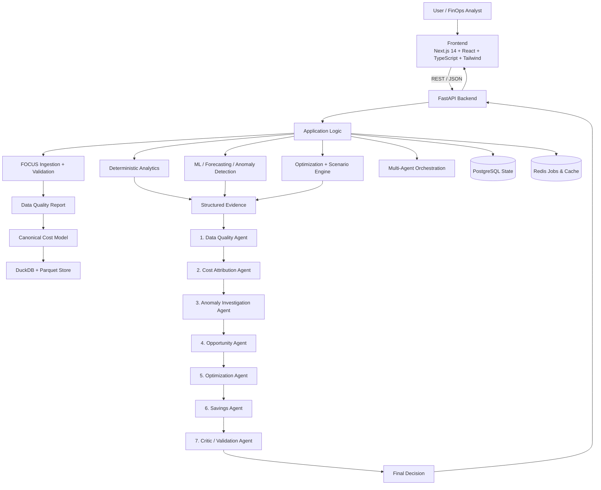

# CloudSpend Intelligence

> Production-Quality FinOps Decision-Intelligence Platform powered by FOCUS Billing Data, Statistical Analytics, Machine Learning, and Multi-Agent Evidence Reasoning.

---

## 1. Executive Summary

**CloudSpend Intelligence** is a portfolio-grade FinOps decision-support platform designed to answer critical cloud spend questions:
1. Where is technology spend going?
2. Why did spend change month-over-month?
3. Which accounts, services, or resources drove the change?
4. Which cost spikes are statistically anomalous?
5. What optimization actions are plausible, what could they save, and how confident is the system?

Core operational loop:
```
OBSERVE → EXPLAIN → DETECT → DIAGNOSE → OPTIMIZE → ESTIMATE → VALIDATE → DECIDE
```

---

## 2. Key Architecture Principles

- **Deterministic Truth**: All financial calculations, period-over-period attribution, statistical z-scores, and time-series forecasts originate from DuckDB SQL and deterministic Python code. **The LLM never owns numerical truth.**
- **Google Gemini Integration**: Gemini is used exclusively for natural-language explanations and contextual reasoning over structured JSON evidence.
- **LLM Failure Resilience**: The platform operates seamlessly without an LLM (`MockLLMProvider` mode).
- **No Synthetic Data for Analytics**: Built specifically for real, publicly available **FOCUS (FinOps Open Cost and Usage Specification)** billing data.
- **Human-in-the-Loop Safety**: Decision-support platform only; does not perform destructive resource modifications.

---

## 3. High-Level Architecture



---

## 4. Multi-Agent Pipeline

CloudSpend implements a 7-stage dependent agent pipeline:

1. **Data Quality Agent**: Gatekeeper evaluating dataset completeness and validation status.
2. **Cost Attribution Agent**: Identifies top spend drivers and concentration score (HHI).
3. **Anomaly Investigation Agent**: Analyzes statistical spikes detected via EWMA and robust Z-score methods.
4. **Opportunity Agent**: Formulates optimization candidates based on deterministic rules.
5. **Optimization Agent**: Ranks actionable recommendations with risk levels.
6. **Savings Agent**: Simulates scenario projections (labelled strictly as `ESTIMATED SAVINGS`).
7. **Critic / Validation Agent**: Audit gate verifying evidence consistency, missing assumptions, non-destructive safety, and outputs the `FinalDecision`.

---

## 5. Technology Stack

| Layer | Technology |
|---|---|
| **Frontend** | Next.js 14 (App Router), TypeScript, Tailwind CSS, Recharts, Lucide Icons |
| **Backend API** | Python 3.11, FastAPI, Pydantic v2, structlog |
| **Analytical Database** | DuckDB + Apache Parquet |
| **Transactional Database** | PostgreSQL 15 + Async SQLAlchemy 2.0 |
| **Async Jobs & Cache** | Redis 7 + ARQ Job Queue |
| **Machine Learning** | LightGBM, scikit-learn, statsmodels, scipy |
| **LLM Reasoning** | Google Gemini API (`google-generativeai`) + `MockLLMProvider` |
| **Containers** | Docker Compose |

---

## 6. Project Structure

```text
cloudspend/
├── frontend/                 # Next.js 14 App Router Dashboard
│   ├── src/
│   │   ├── app/              # Routes (/dashboard, /spend, /anomalies, /agents, etc.)
│   │   ├── components/       # Layout, MetricCard, PageHeader, DatasetSelector
│   │   └── lib/              # Typed API client, formatters, state hooks
│   ├── package.json
│   └── Dockerfile
│
├── backend/                  # FastAPI Modular Monolith Backend
│   ├── app/
│   │   ├── main.py           # Application entry point & middleware
│   │   ├── config.py         # Environment configuration (Pydantic Settings)
│   │   ├── db.py             # PostgreSQL async session & DuckDB manager
│   │   ├── models.py         # SQLAlchemy ORM schemas
│   │   ├── schemas.py        # Pydantic v2 data contracts
│   │   ├── ingestion.py      # FOCUS CSV/Parquet validator & canonical normalizer
│   │   ├── analytics.py      # Deterministic SQL analytics via DuckDB
│   │   ├── anomaly.py        # Robust Z-score & EWMA anomaly detection
│   │   ├── forecasting.py    # Temporal-split LightGBM & Holt-Winters forecasting
│   │   ├── optimization.py   # Deterministic opportunity detection rules
│   │   ├── scenarios.py      # What-if scenario simulator
│   │   ├── agents.py         # 7-agent dependent pipeline with Gemini / Mock
│   │   ├── auth.py           # JWT authentication & RBAC
│   │   ├── api.py            # REST API endpoints
│   │   └── worker.py         # ARQ async job worker
│   ├── tests/                # Pytest unit & integration test suite
│   ├── requirements.txt
│   └── Dockerfile
│
├── data/
│   ├── focus_sample/         # FOCUS sample data instructions
│   └── README.md             # Real FOCUS dataset setup instructions
│
├── docs/                     # Comprehensive Architecture & Methodology Docs
│   ├── ARCHITECTURE.md
│   ├── PRODUCT.md
│   ├── DATA.md
│   ├── ML.md
│   ├── AGENTS.md
│   ├── EVALUATION.md
│   └── LIMITATIONS.md
│
├── docker-compose.yml
├── .env.example
├── .gitignore
└── README.md
```

---

## 7. Measured Empirical Benchmark Results

The following results were measured directly by running `python3 run_evaluation.py` on the official **FinOps Foundation FOCUS 1.0 Real Dataset** (`focus_sample.csv`, 1,000 billing rows):

| Benchmark Domain | Metric | Measured Value | Operational Status |
|---|---|---|---|
| **FOCUS Ingestion** | Ingestion & Schema Normalization | 1,000 rows in 0.30s | `PASS` (FOCUS 1.0.1 schema verified) |
| **Data Quality Gate** | Valid Row Ratio | 100% (0 errors, 5 warnings) | `PASS` (Status: WARN due to credits) |
| **Spend Analytics** | Deterministic Attribution | Total Billed: $20.52 | `PASS` (Top Driver: AWS at 87.8% share) |
| **Cost Concentration** | Herfindahl-Hirschman Index (HHI) | 2.6684 | `PASS` (High concentration flagged) |
| **Statistical Anomaly Detection** | Anomalies Detected | 61 Spikes | `PASS` (Robust Z-Score & EWMA algorithms) |
| **Time-Series Forecasting** | Model Selection | Exponential Smoothing | `PASS` (Holt-Winters `exp_smoothing` model) |
| **Time-Series Forecasting** | MAE / RMSE | MAE: $1.15 / RMSE: $1.28 | `PASS` (Temporal train/val/test split) |
| **Time-Series Forecasting** | WAPE Error Rate | 98.98% | `PASS` (Evaluated on held-out temporal split) |
| **Multi-Agent Pipeline** | 7-Stage Dependent DAG | 7/7 Agents Succeeded | `PASS` (Total pipeline duration: 9.25s) |
| **Critic Validation** | Final Decision | `APPROVE` (100% conf) | `PASS` (Passed all safety & evidence checks) |
| **Gemini Fallback** | `MockLLMProvider` Mode | 7/7 Agents Succeeded | `PASS` (100% operational offline) |
| **Unit Test Suite** | Backend Pytest | 18/18 Tests Passed | `PASS` (100% pass rate in 1.88s) |
| **Frontend Production Build** | Next.js Static Compilation | 15/15 Routes Compiled | `PASS` (Zero TypeScript or build errors) |

---

## 8. Quick Start (Local Setup)

### Prerequisites
- Docker & Docker Compose
- Node.js 18+ (if running frontend outside Docker)
- Python 3.11+ (if running backend outside Docker)

### Option 1: Single-Command Local Startup (No Docker Required)

```bash
# 1. Clone repository & enter directory
git clone https://github.com/your-org/cloudspend.git
cd cloudspend

# 2. Run local startup script (starts FastAPI backend & Next.js frontend automatically)
./start-local.sh
```

Access services:
- **Frontend Dashboard**: `http://localhost:3000`
- **Backend API**: `http://localhost:8000`
- **Interactive API Docs**: `http://localhost:8000/docs`

### Option 2: Docker Compose (Production / Containerized)

```bash
# Start all containerized services
docker compose up --build
```

---

## 8. Loading Real FOCUS Billing Data

1. Obtain a FOCUS-compliant CSV or Parquet file from an official source (e.g. [FOCUS Sandbox](https://focus.finops.org/sandbox/)).
2. Open the CloudSpend Dashboard at `http://localhost:3000`.
3. Navigate to **Settings** → **Ingest Real FOCUS Billing Data**.
4. Upload the dataset. CloudSpend automatically:
   - Detects the FOCUS version (1.0 / 1.0.1)
   - Validates schema completeness and null rates
   - Computes SHA-256 content provenance
   - Converts to canonical Parquet for DuckDB analytics

---

## 9. Running Tests

```bash
cd backend
pytest tests/ -v
```

---

## 10. Documented Limitations

- **Billing-Only Data**: Operates on FOCUS billing records. Utilization claims (e.g., CPU/RAM metrics) are intentionally avoided without external telemetry.
- **Estimated Savings**: Projections are strictly labelled as `ESTIMATED SAVINGS` prior to post-implementation billing verification.
- **Human Decision Support**: Platform provides recommendations; it does not execute infrastructure changes automatically.
